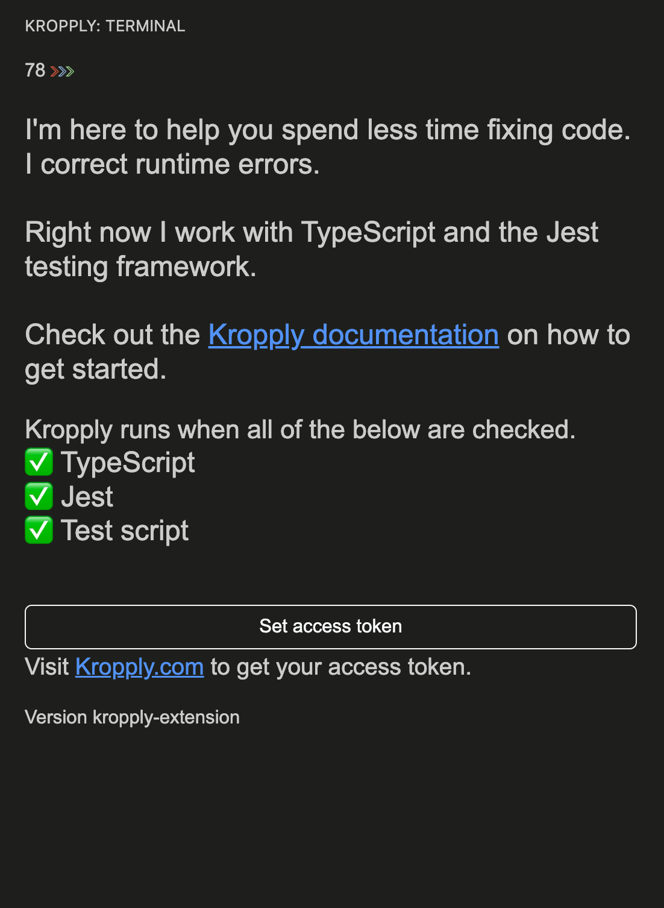

# Integration

Use this section to learn to use the Kropply terminal, where you will receive color coded, intuitive suggestions to debug your code.

### Open Your Terminal
To open and use Kropply, make sure the **three boxes** in Kropply's sidebar are checked off.

### Using the Kropply Terminal

To run your code _______

Blue = Bug explanation \
Green = Step-by-step instruction of how to fix the error

With these messages going directly to your terminal, you can easily understand the errors in your code and fix them in an instant. 

<!---
Here, I need to be updated on running Kropply, as mine is not running

Should we have: 
- desc of which linux commands to use
- block text of refresher on getting file paths, cd, etc
- and can you use the vs code run button yet or should that nor be included?

--->
